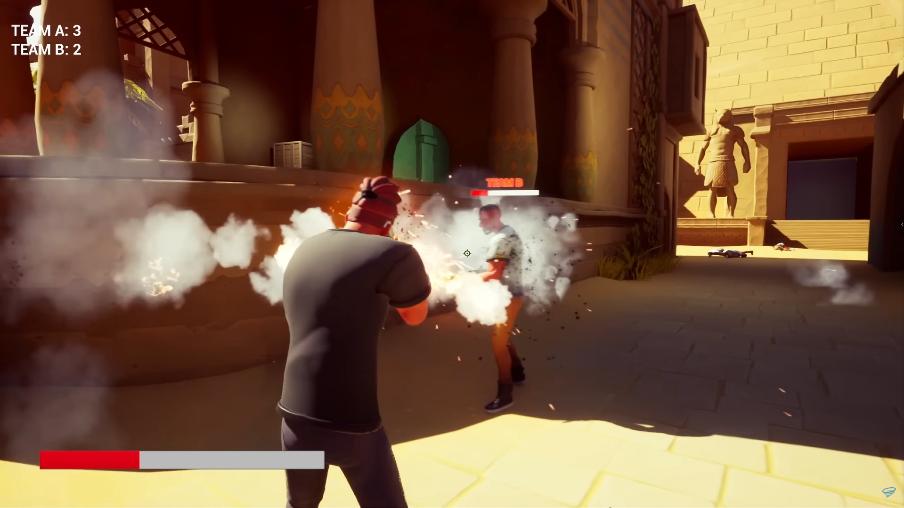
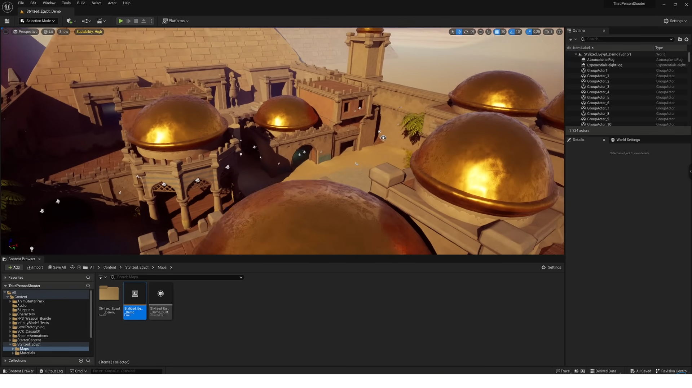
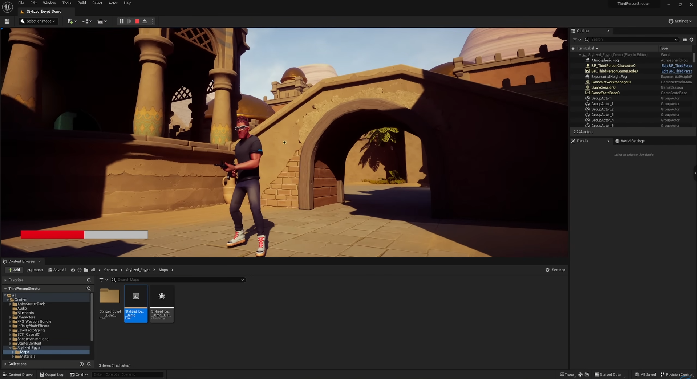
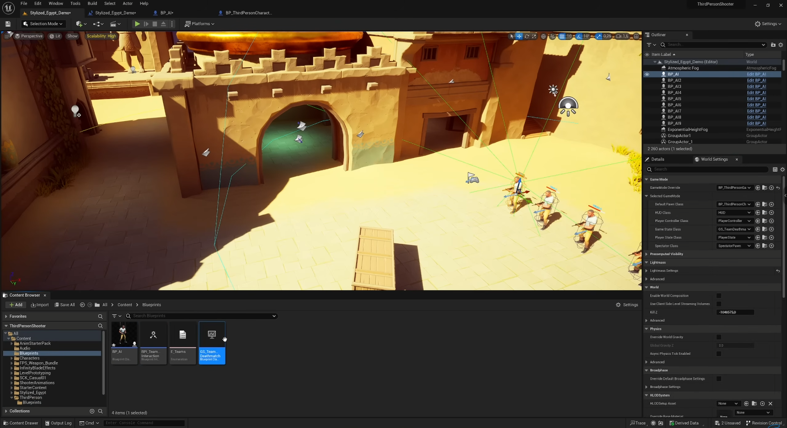

# Simple Team Shooter Game

## Giới thiệu

**Simple Team Shooter** là một trò chơi bắn súng góc nhìn thứ nhất (FPS) với lối chơi đối kháng chia đội. Trong trò chơi này, người chơi được chia làm 2 đội và chiến đấu với nhau để giành chiến thắng. Trò chơi được phát triển bằng **Unreal Engine 5**, với đồ họa chân thực và gameplay nhanh, tập trung vào các trận đấu hành động căng thẳng và chiến thuật phối hợp nhóm.

## Tính năng nổi bật

- **Chia đội chiến đấu**: Trò chơi hỗ trợ hai đội, mỗi đội cố gắng tiêu diệt đối thủ để đạt được mục tiêu trận đấu (ví dụ: đội có số lần tiêu diệt cao nhất hoặc kiểm soát khu vực).
  
- **Hệ thống vũ khí đa dạng**: Người chơi có thể lựa chọn nhiều loại vũ khí khác nhau, từ súng trường, súng bắn tỉa, cho đến vũ khí cận chiến.

- **Gameplay nhanh và căng thẳng**: Đối đầu trong các trận đấu nhanh, đòi hỏi kỹ năng bắn súng, chiến thuật nhóm và khả năng phản xạ tốt.

- **Môi trường chiến đấu chi tiết**: Các bản đồ được thiết kế chi tiết với hiệu ứng ánh sáng và đồ họa đẹp mắt nhờ sức mạnh của Unreal Engine 5.

- **Chế độ chơi nhiều người**: Hỗ trợ chế độ chơi trực tuyến với nhiều người chơi cùng lúc, giúp tăng tính tương tác và cạnh tranh giữa các đội.

## Yêu cầu hệ thống

- **Hệ điều hành**: Windows 10 (64-bit) hoặc cao hơn
- **Bộ xử lý**: Intel Core i5 hoặc AMD tương đương
- **RAM**: 8GB trở lên
- **Card đồ họa**: NVIDIA GTX 1060 hoặc AMD Radeon RX 580 (hỗ trợ DirectX 12)
- **Dung lượng ổ cứng**: Ít nhất 20GB dung lượng trống
- **Kết nối internet**: Yêu cầu để chơi chế độ nhiều người

## Hướng dẫn chơi
- Di chuyển: Sử dụng các phím W, A, S, D để điều khiển nhân vật di chuyển.
- Bắn: Nhấn chuột trái để bắn, chuột phải để ngắm.
- Chuyển vũ khí: Sử dụng phím số (1, 2, 3,...) để thay đổi vũ khí.
- Chiến thuật: Hợp tác với đồng đội để kiểm soát khu vực và tiêu diệt kẻ thù.

## Hình Ảnh
- **HUB:**
  
  
- **Map:**
  
  
- **Map1:**
  
  
- **Team:**
  
  
## Credits

- **[Vo Trung Kien](https://github.com/KaeseyVNK)** - Fullstack

